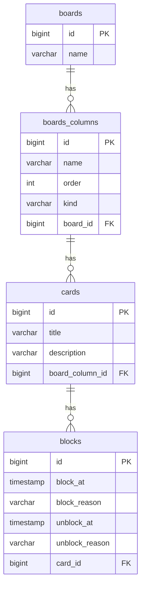

# Board de Tarefas - Projeto Java

Este projeto implementa um board de tarefas utilizando Spring Boot, Gradle, Liquibase, MySQL e Lombok, como parte do bootcamp Decola Tech 2025, da DIO.

## Diagrama de Entidades


## Tecnologias Utilizadas

* **Java:** Linguagem de programação.
* **Spring Boot:** Framework para desenvolvimento de aplicações Java.
* **Gradle:** Ferramenta de build.
* **Liquibase:** Gerenciamento de migrações de banco de dados.
* **MySQL:** Sistema de gerenciamento de banco de dados.
* **Lombok:** Simplifica o código Java (reduzindo boilerplate).

## Pré-requisitos

* JDK 11+ (ou versão compatível)
* MySQL instalado e configurado
* Gradle instalado

## Instalação

1. **Clone o repositório:**
   ```bash
   git clone git@github.com:als-menezes/Board-project-DIO.git>```
3. **Navegue até o diretório do projeto:**
   ```bash
    cd <DIRETORIO_DO_PROJETO>
   ```
4. **Configure o arquivo `application.properties`:**
   - Substitua os placeholders pelas suas credenciais do MySQL:
   ```properties
    spring.datasource.url=jdbc:mysql://localhost:3306/seu_banco_de_dados
    spring.datasource.username=seu_usuario
    spring.datasource.password=sua_senha
   ```
5. **Execute o build:**
   ```bash
    ./gradlew build
   ```

## Execução

```bash
./gradlew bootRun
```

## Migrações do Banco de Dados (Liquibase)

As migrações do banco de dados são gerenciadas pelo Liquibase. Os scripts estão em `src/main/resources/db/migration`.  As migrações serão executadas automaticamente ao iniciar a aplicação.

## Contribuições

Contribuições são bem-vindas! Abra um pull request ou issue.
